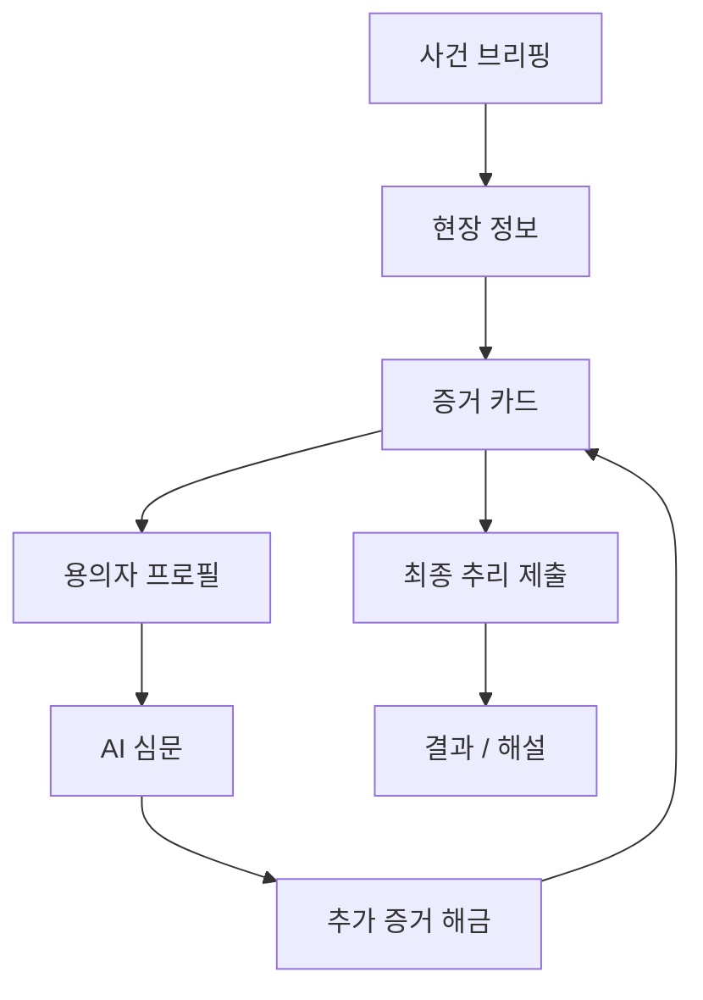
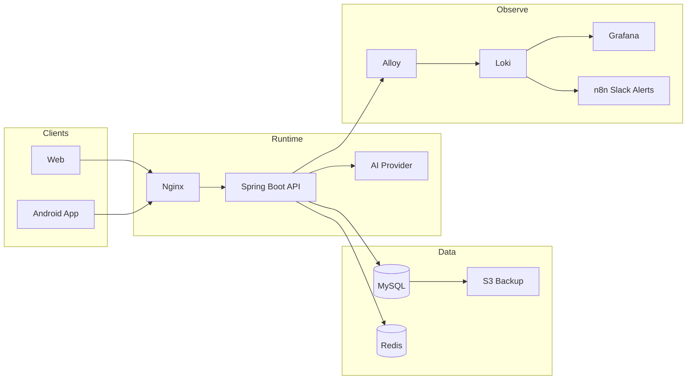

# ClueRoom

<p align="center">
  <strong>AI suspect interrogation mystery game</strong><br>
  증거를 읽고, 용의자를 심문하고, 사건의 빈칸을 채우는 AI 추리게임 플랫폼
</p>

<p align="center">
  <a href="https://www.clueroom.xyz"></a>
  <a href="https://api.clueroom.xyz/actuator/health"></a>
  
  
  
  
</p>

<p align="center">
  
</p>

<p align="center">
  
  
  <br>
  <sub>React/Vite Web production surface. 공개 README에는 스포일러 위험이 낮은 시나리오 상세와 수사 허브 화면만 사용합니다.</sub>
</p>

---

## Case File

ClueRoom은 플레이어가 탐정이 되어 공식 사건을 조사하는 서비스입니다.

사용자는 사건 브리핑을 읽고, 현장/증거/타임라인을 확인한 뒤, AI 용의자에게 질문을 던집니다. AI는 자유롭게 추리해주는 해설자가 아니라 **백엔드가 허용한 공개 정보와 답변 정책 안에서만 말하는 NPC**입니다.

```text
목표: 챗봇과 대화하는 앱이 아니라, 증거를 조합해 추리하는 게임
핵심: AI 답변보다 사건 그래프, 증거 해금, 답변 정책, 최종 추리 채점
원칙: 범인과 정답 정보는 AI에게 직접 주지 않고 백엔드가 관리
```

---

## Proof Snapshot

| Backend | Android App | Web | Scenario Coverage | Scenario API Perf | LLMOps |
|---:|---:|---:|---:|---:|---:|
| **344 PASS** | **32 PASS** + OAuth/session recovery | **23 tests** + core smoke PASS | **25/25 · 35/35** evidence reachability | P95 **241ms -> 19ms** | **95 / 0 / 0** QA-window success/failure/fallback + Redis AI quota |

> Public-safe 보고 기준에 따라 정답, 점수, session/token, raw prompt/answer는 공개 README에 포함하지 않습니다.
> Web core smoke는 주요 플레이 경로 기준입니다. bookmark/review persistence, refresh-cookie retry, QA/dev login 노출 여부는 배포 후 gate로 따로 확인합니다.
> LLMOps 95건 표본은 웹 QA가 섞인 provider window라 organic traffic 평균으로 해석하지 않습니다.

---

## Investigation Loop



플레이는 “질문을 많이 하는 것”보다 “어떤 증거를 누구에게 어떻게 제시할지 결정하는 것”에 가깝게 설계했습니다.

---

## What We Built

| Area | Built |
|---|---|
| Gameplay | 공식 시나리오, 사건 브리핑, 현장 정보, 증거/용의자/타임라인, 최종 추리 |
| AI | 용의자 심문, 최종 추리 채점, prompt policy, response policy resolver |
| Platform | 시나리오 목록/검색, QueryDSL 필터, Redis 30초 캐시, 북마크, 리뷰, 플레이 기록, 커스텀 시나리오 확장 구조 |
| Web/App | Flutter Android 앱과 React/Vite 웹 프론트 공존 |
| Infra | Blue-Green 배포, external data server, S3 backup, Grafana/Loki/n8n 운영 알림 |
| LLMOps | AI_CALL/AI_CALL_CONTEXT 로그, token/latency/failure/fallback 집계, Redis 기반 AI quota, 비용/레이트리밋 보고서 |
| QA | Android E2E, Web E2E, public-safe QA report, 스포일러/정답성 정보 분리 |

---

## Repositories

| Repository | Purpose |
|---|---|
| [`start-up-project`](https://github.com/Final-Project-sixteam-company/start-up-project) | Spring Boot backend, AI/gameplay domain, infra and LLMOps docs |
| [`project-fe`](https://github.com/Final-Project-sixteam-company/project-fe) | Flutter Android app |
| [`clueroom-web-fe`](https://github.com/Final-Project-sixteam-company/clueroom-web-fe) | React/Vite web deployment surface |

---

## System Shape



운영 기준은 `prod API + data server + ops monitoring` 구조입니다.
Scale-out은 Terraform app node와 수동 Nginx load balancing으로 PoC를 완료했고, 현재 운영 기본 구조로 과장하지 않습니다.

---

## Safety Rules for AI Suspects

AI 용의자는 정답을 알고 연기하는 모델이 아닙니다. 백엔드가 만든 안전한 문맥만 보고 짧게 답합니다.

```text
Do not pass culprit identity to NPC prompt.
Do not pass full solution text to NPC prompt.
Do not expose hidden suspect secrets before unlock.
Do not let the model decide response policy.
Do keep answers short, grounded, and policy-bound.
```

LLMOps 보고서도 같은 원칙을 따릅니다.

```text
raw prompt 저장 금지
AI 답변 원문 저장 금지
사용자 질문 전문 저장 금지
token/session id 공개 금지
정답/후보 상세 public report 노출 금지
```

---

## Stack

| Layer | Stack |
|---|---|
| Backend | Java 21, Spring Boot 4, Spring Security, Spring Data JPA, Hibernate, QueryDSL |
| Data | MySQL 8.4, Redis |
| AI/LLMOps | promptVersion, templateHash, AI_CALL, AI_CALL_CONTEXT |
| Android | Flutter, Dart |
| Web | React, TypeScript, Vite |
| Infra | AWS Lightsail, Docker Compose, Nginx Blue-Green, S3 backup |
| Monitoring | Grafana, Loki, Alloy, n8n |
| QA / Performance | Playwright, Android emulator, Web E2E, k6 load test, public-safe reports |

---

## Team Responsibilities

| Focus | Members | Main contribution |
|---|---|---|
| Backend Foundation / Infra / Release Evidence | 황도윤 | 공통 설정, 공식 시나리오 seed, 운영 문서화, PR 리뷰, Blue-Green, monitoring, LLMOps, scale-out PoC, 공개 포트폴리오 근거 정리 |
| AI Interrogation / Prompt Policy | 배강혁 | AI 심문, 최종 추리 채점, prompt policy, 발표자료, 시연 영상 |
| Game Runtime / Evidence Flow | 소수경 | 시나리오, 플레이 세션, 증거 해금, 힌트, 리뷰/북마크 |
| Android / Web / QA Surface | 정채림 | Android UI, 웹 UI, API 연동, E2E 검증 |

---

## Roadmap

```text
1. Web production smoke 마감: QA/dev login gate, bookmark/review persistence, refresh-cookie retry
2. evidence guidance / compare evidence / suggested question UX 고도화
3. AI 심문 prompt context budget 최적화
4. QA traffic과 organic traffic을 분리한 LLMOps 비용 관측 고도화
5. Android 앱과 웹이 공유하는 인증/북마크/리뷰/플레이 기록 계약 유지
```

---

## Links

| Link | URL |
|---|---|
| Web | https://www.clueroom.xyz |
| Product Brochure | [ClueRoom - AI 추리게임 플랫폼](https://sunset-roll-810.notion.site/ClueRoom-AI-383bfd4e7b00818d9a01faf855da5667?source=copy_link) |
| API Health | https://api.clueroom.xyz/actuator/health |
| Backend | [Repository](https://github.com/Final-Project-sixteam-company/start-up-project) |
| Android | [Repository](https://github.com/Final-Project-sixteam-company/project-fe) |
| Web Frontend | [Repository](https://github.com/Final-Project-sixteam-company/clueroom-web-fe) |
