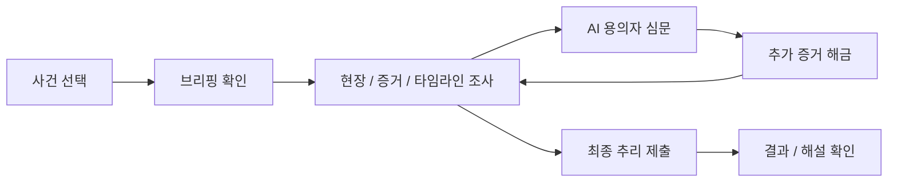
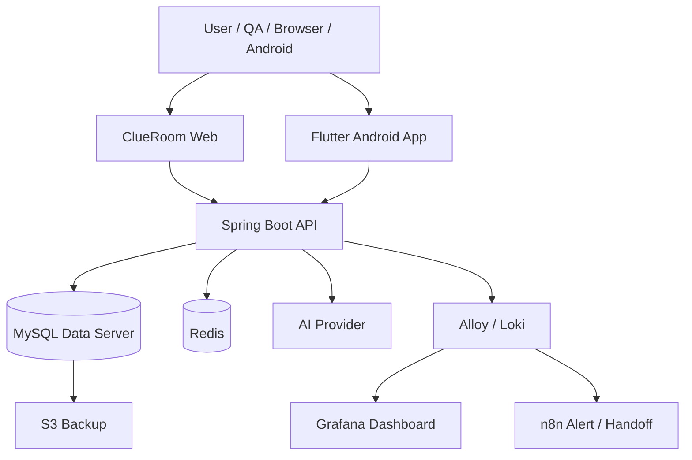

# ClueRoom

> AI 용의자를 심문하고, 증거와 타임라인을 조합해 사건의 진실을 추리하는 AI 추리게임 플랫폼

<p align="center">
  <a href="https://www.clueroom.xyz"></a>
  <a href="https://api.clueroom.xyz/actuator/health"></a>
  
  
  
</p>

---

## 프로젝트 한 줄 소개

ClueRoom은 플레이어가 탐정이 되어 사건 브리핑, 현장 정보, 증거 카드, 타임라인을 확인하고 AI 용의자와 심문하며 범인, 동기, 범행 방법, 은폐 과정을 추리하는 서비스입니다.

핵심은 단순 챗봇이 아니라 **증거 기반 추리 흐름**입니다.  
AI는 용의자 NPC 역할만 수행하고, 정답과 핵심 비밀은 백엔드가 관리합니다.

---

## 플레이 흐름



---

## 주요 기능

| 영역 | 기능 |
|---|---|
| 사건 플레이 | 공식 시나리오 선택, 브리핑, 현장 조사, 증거 카드, 타임라인 |
| AI 심문 | 용의자별 공개 정보와 답변 정책 기반 1~2문장 응답 |
| 추리 제출 | 범인, 동기, 범행 방법, 은폐 방법, 결정적 증거 제출 |
| 플랫폼 기능 | 시나리오 목록, 검색, 북마크, 리뷰, 플레이 기록 |
| 커스텀 시나리오 | 사용자 제작 시나리오와 AI 검증 기반 확장 구조 |
| 운영/관측 | Blue-Green 배포, Grafana/Loki/n8n 알림, LLMOps 토큰/지연 관측 |

---

## Repository Map

| Repository | 역할 | Stack |
|---|---|---|
| [`start-up-project`](https://github.com/Final-Project-sixteam-company/start-up-project) | ClueRoom 백엔드, AI 심문/채점, 시나리오/플레이 도메인, 운영 문서 | Java 21, Spring Boot 4, MySQL, Redis |
| [`project-fe`](https://github.com/Final-Project-sixteam-company/project-fe) | Android 앱 프론트엔드 | Flutter, Dart |
| [`clueroom-toss-miniapp`](https://github.com/Final-Project-sixteam-company/clueroom-toss-miniapp) | 웹 배포용 프론트엔드 | React, TypeScript, Vite |

---

## Architecture



현재 운영 기준은 단일 운영 API 서버와 분리된 data 서버를 중심으로 구성되어 있습니다.  
Scale-out은 운영 기본 구조가 아니라 Terraform app node + 수동 Nginx LB 기반 PoC로 검증했습니다.

---

## AI 설계 원칙

ClueRoom에서 가장 중요한 규칙은 **정답 누설 방지**입니다.

```text
AI에게 "너는 범인이다" 같은 정답 정보를 직접 주지 않는다.
범인, 동기, 범행 방법, 은폐 정보는 백엔드 secret 데이터로 관리한다.
AI에게는 현재 공개된 정보, 해금된 증거, 사용자가 제시한 증거, 선택된 답변 정책만 전달한다.
AI 응답은 1~2문장으로 제한한다.
설정에 없는 사실을 생성하지 않는다.
```

---

## Tech Stack

| Layer | Stack |
|---|---|
| Backend | Java 21, Spring Boot 4, Spring Security, JPA, QueryDSL |
| Database | MySQL 8.4, Redis |
| AI | Prompt policy, response policy resolver, AI_CALL / AI_CALL_CONTEXT telemetry |
| Android | Flutter, Dart |
| Web | React, TypeScript, Vite |
| Infra | AWS Lightsail, Docker Compose, Nginx Blue-Green, S3 backup |
| Monitoring | Grafana, Loki, Alloy, n8n Slack workflow |
| QA | Playwright, Android emulator E2E, public-safe QA reports |

---

## 운영과 LLMOps

ClueRoom은 AI 호출이 핵심 gameplay에 직접 영향을 주기 때문에 일반 서버 모니터링과 별도로 LLMOps를 운영합니다.

관측 기준:

- `AI_CALL`: feature, provider, model, promptVersion, latency, success/failure, token 사용량
- `AI_CALL_CONTEXT`: prompt block별 token estimate, evidence count, history turns, template hash
- raw prompt, AI 답변 원문, 사용자 질문 전문, token/session id는 public report에 저장하지 않음
- sessionId/scenarioId/suspectId 같은 high-cardinality 값은 Prometheus label로 사용하지 않음

---

## 팀 역할

| 담당 | 역할 |
|---|---|
| 리더 / 인프라 / 공식 시나리오 / PR 리뷰 | 운영 구조, 배포, 모니터링, seed data, 문서 최신화 |
| AI 백엔드 | AI 심문, 최종 추리 채점, 프롬프트와 응답 정책 |
| 핵심 백엔드 | 시나리오, 플레이 세션, 증거 해금, 힌트, 리뷰/북마크 |
| 프론트엔드 / QA | Android UI, 웹 UI, API 연동, E2E 검증 |

---

## 현재 집중 영역

- 웹 배포 표면의 모바일 사용성 안정화
- 증거 상세 guidance, 함께 볼 증거, 추천 질문 UX 개선
- `npc_interrogation_v1` prompt token 비용 절감
- QA/운영 traffic을 분리한 LLMOps 비용 측정
- 앱과 웹이 같은 백엔드 계약을 공유하도록 인증, 북마크, 리뷰, 플레이 기록 호환 유지

---

## Links

- Web: https://www.clueroom.xyz
- API: https://api.clueroom.xyz
- Backend: https://github.com/Final-Project-sixteam-company/start-up-project
- Android: https://github.com/Final-Project-sixteam-company/project-fe
- Web Frontend: https://github.com/Final-Project-sixteam-company/clueroom-toss-miniapp
